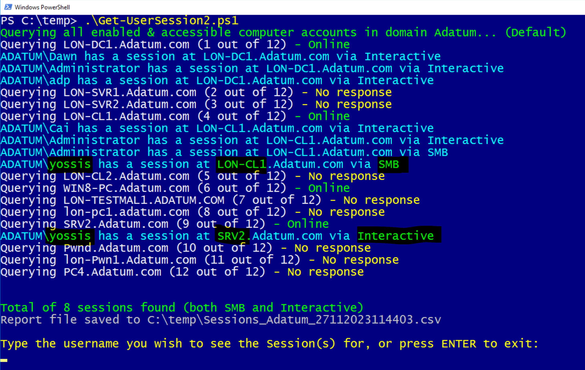
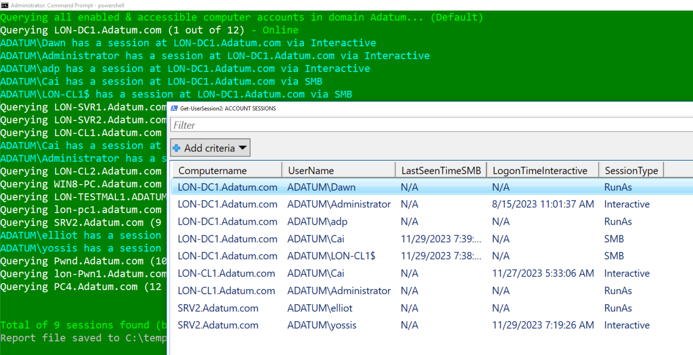
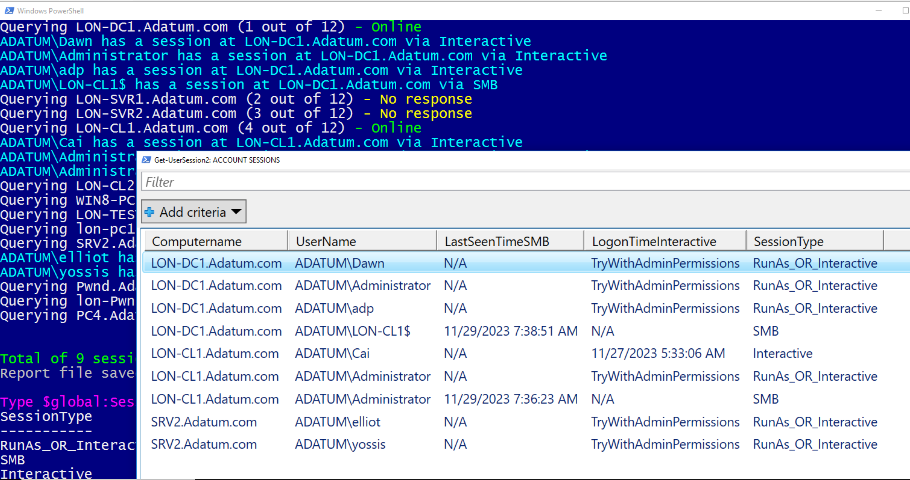
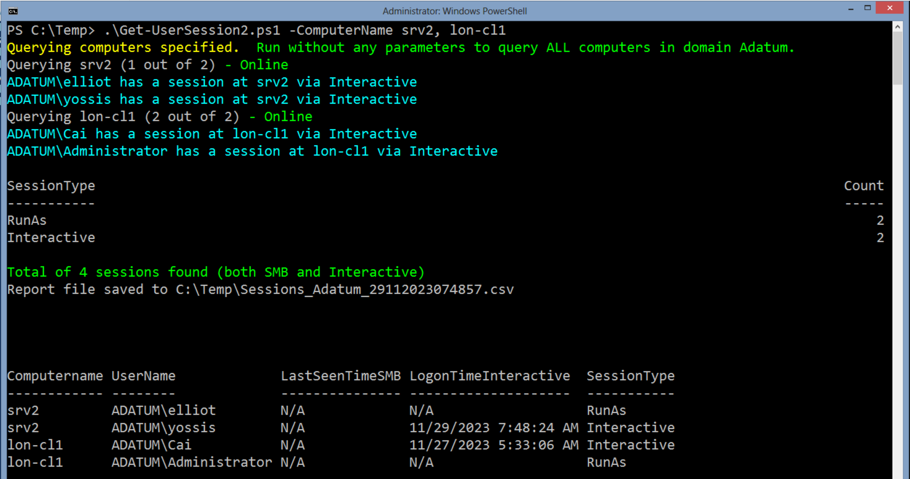

# Get-UserSession2
Map account sessions at the entire domain endpoints or specific hosts. Both SMB remote sessions (users connected via smb) and interactive (RDP, local, Run As), with No admin permissions needed (optional, admin needed just for interactive logon times only).

Agentless, "living off the land" script (No dependencies required, e.g. no ActiveDirectory Module needed or RSAT) for mapping user sessions AND SMB open sessions (Remotely, using NetSessionEnum API) in a 'Hacktive Directory' domain.
No special permissions required on domain endpoints (any authenticated user should be OK). requires port 445 to be open on EndPoints (uses Remote Registry w/psloggedon.exe, SysInternals/Microsoft's tool).

By default, tries to query all enabled computer accounts in the domain. Can also specify specific computer(s).

The optional parameter COMPUTERNAME allow to specifiy one or more computers to query for interactive and/or SMB sessions connected to them. 

Default is empty/optional - entire domain is queried for all online hosts.
  
For example, here below you can see that user YOSSIS is interactively logged-on at SRV2 (either RDP/console or via Run As), yet is accessing LON-CL1 via SMB from that session.
  

  
Below you can see sample results when running as an Admin:
  

  
Here you can see sample results when running as a Non-Admin user - no indication of LogonTimes of Interactive/RunAs sessions is available, remotely:
  

  
Screenshot for sample results when running against Specific Computers, and from a legacy system:
  

  
Note 1:
### LogonTime (for interactive) and Last Connected via SMB dateTime are logged into the CSV
(Can also be shown in console or grid).

Note 2: 
### If you need to know whether the interactive session(s) are Active or Disconnected, please use the 'original' "Get-UserSession" script (https://github.com/YossiSassi/Get-UserSession) 
- Note that it only shows interactive sessions, not account connected via SMB shares.
